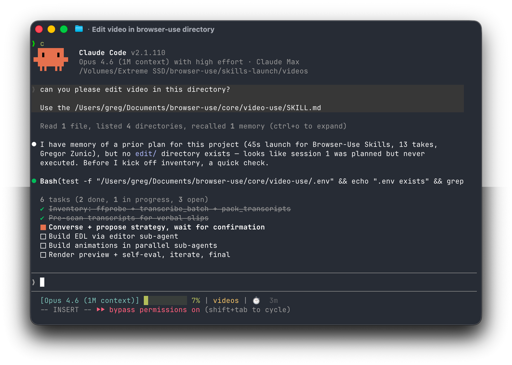

<p align="center">
  
</p>

# video-use

A Claude Code skill that edits video by conversation. Drop footage in a folder, launch Claude Code, have a conversation, iterate until it's right. Works for any content — talking heads, montages, tutorials, travel, interviews — without presets or menus.

## How the LLM understands video

The LLM never watches the video. It reads it — through two layers that together give it everything it needs to make edit decisions with word-boundary precision.

<p align="center">
  
</p>

### Layer 1 — Audio transcript (always loaded)

A single ElevenLabs Scribe API call per source file gives the LLM:

- **Every word** with millisecond-precision timestamps
- **Speaker diarization** — who's talking when (stable within a file)
- **Audio events** interleaved at the same level as words — `(laughter)`, `(applause)`, `(sigh)`, `(music)`. These are the real editorial signals: laughs mark beats to preserve, silences mark cut candidates, speaker changes mark transitions.

The raw Scribe JSONs get packed into a single `takes_packed.md` — one phrase-level time-annotated line per chunk, grouped on silences >= 0.5s. This is the LLM's primary reading view. 13 raw JSONs from a multi-take shoot become one 12KB markdown file that fits in a fraction of the context window while preserving word-boundary cut precision.

```
## C0103  (duration: 43.0s, 8 phrases)
  [002.52-005.36] S0 Ninety percent of what a web agent does is completely wasted.
  [006.08-006.74] S0 We fixed this.
  [008.02-009.14] S0 When a web agent comes...
```

### Layer 2 — Visual composite (on demand)

`timeline_view` generates a single composite PNG for any requested time range: a horizontal **filmstrip** of N thumbnails from the video, a **waveform** ribbon showing the audio amplitude envelope, **word labels** aligned to the waveform, **silence gaps** shaded, and **cut candidates** marked at silences >= 400ms.

The LLM calls this only at decision points — an ambiguous pause, a retake pair to compare visually, a cut-point sanity check. One image replaces every visual preprocessing pass (shot detection, CLIP classification, OCR, emphasis scoring) because the LLM reads the composite natively and gets all of that information at once.

This is the key insight: the same way browser-use gives an LLM a structured DOM instead of a screenshot, this skill gives it a structured text view of the audio plus on-demand visual composites instead of raw video frames. 30,000 frames at ~1,500 tokens each = 45M tokens. One packed transcript + images at decision points = ~12KB of text + a handful of PNGs.

### The pipeline

```
Transcribe ──> Pack ──> LLM Reasons ──> EDL ──> Render ──> Self-Eval
   (Scribe,      (N JSONs      (reads transcript,     (.json)   (ffmpeg       (timeline_view
    parallel,      into 1        calls timeline_view              pipeline)     on the output
    cached)        markdown)     at decision points)                            at every cut)
                                                                         │
                                                                         └── issue? fix + re-render (max 3)
```

The self-eval loop runs `timeline_view` on the **rendered output** (not the sources) at every cut boundary — checking for visual jumps, audio pops, hidden subtitles, misaligned overlays. The LLM verifies its own work before showing anything to the user.

## Install

```bash
# 1. Symlink into ~/.claude/skills so any Claude Code session can use it
ln -s "$(pwd)" ~/.claude/skills/video-use

# 2. Install Python deps
pip install -e .

# 3. Set your ElevenLabs API key
cp .env.example .env
$EDITOR .env                  # paste ELEVENLABS_API_KEY=...

# 4. System tools
brew install ffmpeg           # required
brew install yt-dlp           # optional, for downloading online sources
```

Python 3.10+ recommended (helpers also work on 3.9 via `from __future__ import annotations`).

## Use

```bash
cd /path/to/your/videos       # wherever your source files live
claude                         # start a Claude Code session
```

Then in the session:

> edit these videos into a launch video

The skill will inventory the sources, ask about what you're making, propose a strategy, wait for your confirmation, then produce `edit/final.mp4` next to the sources. All outputs go into `<videos_dir>/edit/` — the skill directory stays clean.

```
<videos_dir>/
├── <source files, untouched>
└── edit/
    ├── project.md               memory; appended every session
    ├── takes_packed.md          the LLM's primary reading view
    ├── edl.json                 cut decisions with per-range reasoning
    ├── transcripts/<name>.json  cached raw Scribe JSON per source
    ├── animations/slot_<id>/    per-animation source + render
    ├── clips_graded/            per-segment extracts with grade + fades
    ├── master.srt               output-timeline subtitles
    ├── preview.mp4
    └── final.mp4
```

## What's in this repo

```
video-use/
├── SKILL.md               the product — instructions for Claude Code
├── pyproject.toml
├── .env.example
├── poster.html            visual overview of the harness
├── helpers/
│   ├── transcribe.py        ElevenLabs Scribe (single file, --num-speakers optional)
│   ├── transcribe_batch.py  4-worker parallel transcription for multi-take
│   ├── pack_transcripts.py  raw JSON → phrase-level markdown
│   ├── timeline_view.py     filmstrip + waveform composite PNG
│   ├── render.py            per-segment extract → concat → overlays → subtitles LAST
│   └── grade.py             ffmpeg color grade (presets + custom filter strings)
└── skills/
    └── manim-video/       vendored from hermes-agent for Manim animation expertise
```

## Design principles

1. **The LLM reasons from text + on-demand visuals.** The transcript is the primary surface. Visual composites are drill-downs at decision points. Preprocessing beyond the packed-phrase view is the antipattern.
2. **Audio is primary, visuals follow.** Cut candidates come from speech boundaries, silence gaps, and audio events. Visuals confirm, they don't drive.
3. **Ask, confirm, execute, self-eval, iterate, persist.** Never edit before the user confirms the strategy. Verify your own output before presenting it.
4. **Generalize.** Zero assumptions about content type. Look at the material, ask the user, then edit.
5. **Artistic freedom is the default.** Every preset, palette, font, and duration in the skill is a worked example from one proven video — not a mandate. The only mandates are the 12 production-correctness hard rules in SKILL.md that prevent silent failures (subtitles LAST, 30ms audio fades, PTS shift on overlays, never cut mid-word, etc.).
6. **Invent freely.** If the material calls for split-screen, PiP, lower-thirds, reaction cuts, speed ramps, freeze frames — build it. The helpers are ffmpeg and PIL. They can do anything.

Production rules and anti-patterns are derived from real-world notes from shipping a launch video end-to-end with this skill.
